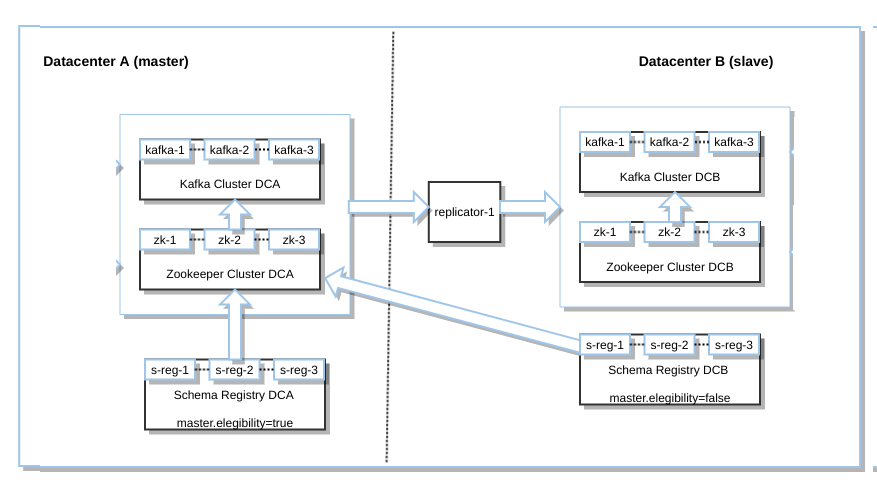

# Kafka Docker Cluster Workshop

# Table Of Contents
1. [Document objective](#1-document-objective)
2. [Hardware Requirements](#2-hardware-requirements)
3. [Software Requirements](#3-software-requirements)
4. [Exercises](#4-exercises)

4.1. [Starting and Stopping your laboratory](#4-1-starting-and-stopping-your-laboratory)

4.2. [Messaging Tests](##4-2-messaging-tests)

4.2.1. [Publish-Subscribe messaging using command line Kafka scripts](#4-2-1-publish-subscribe-messaging-using-command-line-kafka-scripts)

4.2.2. [MirrorMaker message replication between clusters](#4-2-2-mirrormaker-replication-between-clusters)

4.2.3. [Enterprise Replicator message replication between clusters](#4-2-3-enterprise-replicator-replication-between-clusters)

4.2.4. [Enterprise Replicator disaster recovery test](#4-2-4-enterprise-replicator-disaster-recovery-test)

## 1 Document objective

 Following the steps of this workshop will give you a full Kafka cluster lab to run in your laptop.
 This lab will help you to test that verify that Enterprise Replicator and Registry allow to recover
 a Kafka cluster from a datacenter where ther process has crashed to a new one, rescuing the topics
 with their data, and cloning the commits and the offsets.

 After the system has been restored to the replica datacenter, we expect to see Kafka producers and consumers
 keep working where they left with zero data loss.

 This is the architecture that you may expect to have built and tested after you have completed them:

 Let's go for it!

## 2 Hardware Requirements

 The minimum hardware requirements are:

   - 16 Gb RAM (8 GB could be too low)
   - 30 GB disk

## 3 Software Requirements

 In order to follow the exercises in this tutorial we will need to install in our laptop
 Docker, Docker Compose and JMeter.

 ***[Ubuntu laptops](./InstalarEnUbuntu.md)***, install Docker and Docker Compose.

## 4-1 Starting and Stopping your laboratory

  You'll find the "scripts" folder, and there the LABORATORIO.sh script. This uses a config
  file called LABORATORIO.conf. This will help you to tweak your lab, adding or removing racks,
  nodes, changing docker image versions and forwarding to different ports.

  ***Config file content***

        $ cat config/LABORATORIO.conf

        DOCKER_COMPOSE_ZK_KAFKA          ../docker/linux/zk-kafka.yml
        DOCKER_COMPOSE_SCHEMA_REGISTRY   ../docker/linux/schema-registry.yml
        DOCKER_COMPOSE_KAFKA_CONNECT     ../docker/linux/kafka-connect.yml
        DOCKER_COMPOSE_KAFKA_REST        ../docker/linux/kafka-rest.yml
        DOCKER_COMPOSE_REPLICATOR        ../docker/linux/replicator.yml
        DOCKER_COMPOSE_DB2_ELK_MYSQL     ../docker/linux/db2elkmysql.yml
        INDICE_REPLICACION_DATACENTER    2
        NODOS_REPLICATOR                 1
        CP_VERSION                       latest
        ZOOKEEPER_PORT                   2181
        ZOOKEEPER_INTERNAL_PORT_1        22888
        BROKER_PORT                      9092
        CONNECT_PORT                     8083
        REST_PORT                        8082
        REGISTRY_PORT                    8081
        REPLICATOR_PORT                  8083
        REST_BINDING_PORT                1882
        REGISTRY_BINDING_PORT            1771
        CONNECT_BINDING_PORT             1553
        REPLICATOR_BINDING_PORT          1993
        REINICIAR                        on-failure:1
        RED                              confluent-network

  ***Start, stop, check and reset our lab's containers***

     $ ./LABORATORIO.sh

        Use:

        ./LABORATORIO.sh iniciar iniciar [dc1|dc2|todo]

        ./LABORATORIO.sh verificar

        ./LABORATORIO.sh parar [dc1|dc2|todo]

        ./LABORATORIO.sh borrar

         []: indica que es obligatorio elegir. Por ejemplo, "iniciar" requerirá indicar si vamos a iniciar únicamente
         dc1 o si vamos a iniciar todos los datacenter.

          * 'dc1' se refiere a los contenedores del rac principal.
          * 'dc2' se refiere a los contenedores del rac secundario.
          * 'todos' se refiere a ambos datacenter.

   ***start our lab*** use the 'iniciar' parameter, followed by what you want to start.
   If you i.e. want to launch both datacenter, issue this command:

        $ ./LABORATORIO.sh iniciar todo

   ***Stop your lab*** use 'parar' as first parameter, and next say what you want to stop.

   If you i.e. want to stop secondary datacenter dc2, use this:

     $ ./LABORATORIO.sh parar dc2

   If you want to stop everything, use this:

     $ ./LABORATORIO.sh parar todo

   ***Verify*** what's going on with your lab machines using this parameter:

     $ ./LABORATORIO.sh verificar

   ***Reset*** your lab to the initial state cleaning temporary archives and removing topics. This will set
   your lab ootb, wiping out any trace of modifications, broken files, full disks, machines not starting ...:

     $ ./LABORATORIO.sh borrar

## 4-2 Messaging Tests

  Let's launch a few messaging tests:

     - Sending and consuming messages from a topic using the Kafka commands
     - Replica between clusters with MirrorMaker
     - Enterprise Replicator message replication between clusters
     - JMeter stress tests

## 4-2-1 Publish-Subscribe messaging using command line Kafka scripts

 Our first test is to make sure through the scripts provided by Kafka, that the three brokers in our lab's cluster
 do really work in cluster mode.

  For this we will use:

    - the "kafka-topics" command, to create a topic,
    - the "kafka-console-producer" command, to send messages from one of the brokers to the topic itself,
    - the "kafka-console-consumer" command, to pull messages from the topic, using any of the three brokers as a source.

 ***We will follow these steps***

    1) Open four Linux terminals

    2) From one of the terminals, create a topic

         docker@docker:~$ docker exec -it dc1_kafka-1_1 \
                                    kafka-topics --create \
                                   --zookeeper dc1_zookeeper-1_1:2181,dc1_zookeeper-2_1:2181,dc1_zookeeper-3_1:2181  \
                                   --replication-factor 3 --partitions 3 --topic pruebaencluster

       Command result will be:

         Created topic "pruebaencluster".

    3) Then, check about the topic. In order to test the cluster use a different node from the one that we created the topic.
       In this example, we are using dc1_kafka-3_1 to create it:

         docker@docker:~$ docker exec -it dc1_kafka-3_1 \
             kafka-topics --describe --topic pruebaencluster \
             --zookeeper dc1_zookeeper-1_1:2181,dc1_zookeeper-1_1:2181,dc1_zookeeper-1_1:2181

       Command will return this:

        Topic:pruebaencluster	PartitionCount:3	ReplicationFactor:3	Configs:
            Topic: pruebaencluster	Partition: 0	Leader: 3	Replicas: 3,2,1	Isr: 3,2,1
            Topic: pruebaencluster	Partition: 1	Leader: 1	Replicas: 1,3,2	Isr: 1,3,2
            Topic: pruebaencluster	Partition: 2	Leader: 2	Replicas: 2,1,3	Isr: 2,1,3

    4) Next, open a producer from a terminal:

         docker@docker:~$ docker exec -it dc1_kafka-3_1 \
                     kafka-console-producer \
                    --broker-list dc1_kafka-1_1:9092,dc1_kafka-2_1:9092,dc1_kafka-3_1:9092 \
                    --topic pruebaencluster

       then write three messages on it, to send them to the topic

         mensaje 1
         mensaje 2
         mensaje 3

    5) Finally, use three different terminals, one for each broker in the Kafka cluster, and consume
       the messages that we have sent to the topic:

         docker@docker:~$ docker exec -it dc1_kafka-1_1 \
                                kafka-console-consumer \
                                --bootstrap-server dc1_kafka-1_1:9092,dc1_kafka-2_1:9092,dc1_kafka-3_1:9092 \
                                --topic pruebaencluster --from-beginning

         docker@docker:~$ docker exec -it dc1_kafka-2_1 \
                                kafka-console-consumer \
                                --bootstrap-server dc1_kafka-1_1:9092,dc1_kafka-2_1:9092,dc1_kafka-3_1:9092 \
                                --topic pruebaencluster --from-beginning

         docker@docker:~$ docker exec -it dc1_kafka-3_1 \
                                kafka-console-consumer \
                                --bootstrap-server dc1_kafka-1_1:9092,dc1_kafka-2_1:9092,dc1_kafka-3_1:9092 \
                                --topic pruebaencluster --from-beginning

    All the three consumer windows will return the three messages that we inserted earlier in the topic:

        mensaje 2
        mensaje 1
        mensaje 3
        Processed a total of 3 messages

## 4-2-2 MirrorMaker message replication between clusters

  To carry out the MirrorMaker tests we have provided the mirrormaker.sh script, located in the "scripts" folder
  from the Git repository. The script is self-descriptive:

      $ ./mirrormaker.sh
    
       Use:

       Start MirrorMaker from a terminal with this parameter

       $ ./mirrormaker.sh iniciarmirrormaker

       Then, open a new terminal and produce keyed messages in the primary datacenter with this command

       $ ./mirrormaker.sh producir SinClave <nummensajes>

       or use this to produce the messages without key

       $ ./mirrormaker.sh producir ConClave <nummensajes>

       Open a new window and consume from the secondary datacenter the messages that has been replicated by
       MirrorMaker from the primary with this command:

       $ ./mirrormaker.sh consumir dc2
 
 ***We can verify the operation of MirrorMaker following these steps:***

 1) Make sure to have all the datacenter started using this command:
 
    $ ./LABORATORIO.sh iniciar todoslosdatacenter 
 
 2) Next, start MirrorMaker:

         docker@docker:~/scripts$ ./mirrormaker.sh iniciarmirrormaker

 2) Next, start a message consumer from the topic in the primary datacenter's Kafka cluster:

         docker@docker:~/scripts$ ./mirrormaker.sh consumir dc1

    Screen will be waiting for messages to arrive. It will start printing them as soon as we
    launch the producer command in step 4)
    
 3) Next, start a message consumer from the topic in the secondary datacenter's Kafka cluster, where MirrorMaker
    should be replicating the messages as soon as they're inserted in the next step:

         docker@docker:~/scripts$ ./mirrormaker.sh consumir dc2

    Screen will also be still, waiting for messages

 4) Start producing messages from a new terminal. If you want them to be unkeyed use this command:
    
         docker@docker:~/scripts$ ./mirrormaker.sh producir SinClave <nummensajes>

    If you want them keyed, use that one:
    
         docker@docker:~/scripts$ ./mirrormaker.sh producir ConClave <nummensajes>

    Once the script has inserted the messages in the topic, we will begin to see them in the previous
    consumer windows that we opened in steps 2) and 3):

         docker@docker:~/scripts$ ./mirrormaker.sh consumir dc1

            CreateTime:1508763949172	9971
            CreateTime:1508763949172	9974
            CreateTime:1508763949173	9977
            CreateTime:1508763949173	9980
            CreateTime:1508763949173	9983
            CreateTime:1508763949173	9986
            CreateTime:1508763949173	9989
            CreateTime:1508763949174	9992
            CreateTime:1508763949174	9995
            CreateTime:1508763949174	9998
            ^CProcessed a total of 10000 messages

         docker@docker:~/scripts$ ./mirrormaker.sh consumir dc2
            CreateTime:1508763949172	9971
            CreateTime:1508763949172	9974
            CreateTime:1508763949173	9977
            CreateTime:1508763949173	9980
            CreateTime:1508763949173	9983
            CreateTime:1508763949173	9986
            CreateTime:1508763949173	9989
            CreateTime:1508763949174	9992
            CreateTime:1508763949174	9995
            CreateTime:1508763949174	9998
            ^CProcessed a total of 10000 messages

## 4-2-3 Enterprise Replicator message replication between clusters

 To carry out the Enterprise Replicator tests we have provided with the enterprisereplicator.sh script,
 located in the "scripts" folder of the Git repository.

 Launching it without parameters is self-descriptive:

        $ ./enterprisereplicator.sh***

         Forma de uso:

         $ ./enterprisereplicator.sh iniciarenterprisereplicator
         $ ./enterprisereplicator.sh producir SinClave <nummensajes>
         $ ./enterprisereplicator.sh producir ConClave <nummensajes>
         $ ./enterprisereplicator.sh consumir dc1
         $ ./enterprisereplicator.sh consumir dc2

 ***Testing steps for Enterprise Replicator:***

 1) Make sure all the datacenters are up and running:
 
        docker@docker:~/scripts$ ./LABORATORIO.sh iniciar todoslosdatacenter 

 2) Run a consumer in the main datacenter:

         docker@docker:~/scripts$ ./enterprisereplicator.sh consumir dc1

    This will be in standby, waiting to receive messages. We will create them in step 4)

 3) Run a consumer in the secondary datacenter:

         docker@docker:~/scripts$ ./enterprisereplicator.sh consumir dc2

    This will also be in standby, waitiing to receive the messages that Enterprise Replicator
    will be transfering from topic in the main datacenter Kafka cluster to the secondary
    datacenter Kafka cluster

 4) Launch the "enterprisereplicator.sh" script with the parameters "producir", "SinClave" or "ConClave"
    depending on whether you want the messages to be generated keyed or un-keyed, and a number of messages.

         docker@docker:~/scripts$ ./enterprisereplicator.sh producir SinClave <nummensajes>
   or
         docker@docker:~/scripts$ ./enterprisereplicator.sh producir ConClave <nummensajes>
 
 
  Once the script starts inserting the messages in the main datacenter Kafka cluster's topic, we will
  see them in the windows of the consumer commands that we opened in steps 2) and 3):

         docker@docker:~/scripts$ ./enterprisereplicator.sh consumir dc1

            CreateTime:1525629947042	9979	9979
            CreateTime:1525629947042	9980	9980
            CreateTime:1525629947042	9981	9981
            CreateTime:1525629947042	9982	9982
            CreateTime:1525629947042	9983	9983
            CreateTime:1525629947042	9984	9984
            CreateTime:1525629947042	9985	9985
            CreateTime:1525629947042	9986	9986
            CreateTime:1525629947042	9987	9987
            CreateTime:1525629947042	9988	9988
            CreateTime:1525629947042	9989	9989
            CreateTime:1525629947042	9990	9990
            CreateTime:1525629947042	9991	9991
            CreateTime:1525629947042	9992	9992
            CreateTime:1525629947042	9993	9993
            CreateTime:1525629947042	9994	9994
            CreateTime:1525629947042	9995	9995
            CreateTime:1525629947042	9996	9996
            CreateTime:1525629947042	9997	9997
            CreateTime:1525629947042	9998	9998
            CreateTime:1525629947042	9999	9999
            CreateTime:1525629947042	10000	10000

            Processed a total of 10000 messages

         docker@docker:~/scripts$ ./enterprisereplicator.sh consumir dc2

            CreateTime:1525629947042	9986	9986
            CreateTime:1525629947042	9987	9987
            CreateTime:1525629947042	9988	9988
            CreateTime:1525629947042	9989	9989
            CreateTime:1525629947042	9990	9990
            CreateTime:1525629947042	9991	9991
            CreateTime:1525629947042	9992	9992
            CreateTime:1525629947042	9993	9993
            CreateTime:1525629947042	9994	9994
            CreateTime:1525629947042	9995	9995
            CreateTime:1525629947042	9996	9996
            CreateTime:1525629947042	9997	9997
            CreateTime:1525629947042	9998	9998
            CreateTime:1525629947042	9999	9999
            CreateTime:1525629947042	10000	10000
            Processed a total of 10000 messages

         docker@docker:~$ docker exec -it dc2_kafka-3_1 \
                                kafka-console-consumer \
                                --bootstrap-server dc1_kafka-1_1:9092,dc1_kafka-2_1:9092,dc1_kafka-3_1:9092 \
                                --topic topicreplicador --from-beginning

## 4-2-4 Enterprise Replicator disaster recovery test

        docker@docker:~/scripts$ ./LABORATORIO.sh borrar
        Contenedores borrados

        docker@docker:~/scripts$ ./LABORATORIO.sh iniciar dc1

        Creating dc1_zookeeper-3_1 ... done
        Creating dc1_zookeeper-2_1 ... done
        Creating dc1_zookeeper-1_1 ... done
        Creating dc1_kafka-3_1     ... done
        Creating dc1_kafka-1_1     ... done
        Creating dc1_kafka-2_1     ... done
        Creating dc2_replicator_1 ... done
              Name                   Command            State              Ports
        ------------------------------------------------------------------------------------
        dc1_kafka-1_1       /etc/confluent/docker/run   Up      9092/tcp
        dc1_kafka-2_1       /etc/confluent/docker/run   Up      9092/tcp
        dc1_kafka-3_1       /etc/confluent/docker/run   Up      9092/tcp
        dc1_zookeeper-1_1   /etc/confluent/docker/run   Up      2181/tcp, 2888/tcp, 3888/tcp
        dc1_zookeeper-2_1   /etc/confluent/docker/run   Up      2181/tcp, 2888/tcp, 3888/tcp
        dc1_zookeeper-3_1   /etc/confluent/docker/run   Up      2181/tcp, 2888/tcp, 3888/tcp
              Name                  Command            State         Ports
        -------------------------------------------------------------------------
        dc2_replicator_1   /etc/confluent/docker/run   Up      8083/tcp, 9092/tcp
        Configuramos MirrorMaker ...

        $ ./enterprisereplicator.sh iniciarenterprisereplicator
        Creamos el tópico "topicreplicador" en el dc1 ...
        Created topic "topicreplicador".
        Topic:topicreplicador	PartitionCount:3	ReplicationFactor:3	Configs:
            Topic: topicreplicador	Partition: 0	Leader: 2	Replicas: 2,3,1	Isr: 2,3,1
            Topic: topicreplicador	Partition: 1	Leader: 3	Replicas: 3,1,2	Isr: 3,1,2
            Topic: topicreplicador	Partition: 2	Leader: 1	Replicas: 1,2,3	Isr: 1,2,3

        Consultamos los nombres de los conectores que existen antes de crear ninguno. Debe retornarnos una lista vacía ...

        []

        Creamos el conector 'conector-replicador' llamando a Kafka Connect REST API. Obligamos a que se clonen las particiones      es decir, las particiones del tópico "topicreplicador" se replicarán en contenido y orden desde el Datacenter A al Datacenter B ...

        {
           "config" : {
              "dest.zookeeper.connect" : "dc2_zookeeper-1_1:2181,dc2_zookeeper-2_1:2181,dc2_zookeeper-3_1:2181",
              "src.zookeeper.connect" : "dc1_zookeeper-1_1:2181,dc1_zookeeper-2_1:2181,dc1_zookeeper-3_1:2181",
              "connector.class" : "io.confluent.connect.replicator.ReplicatorSourceConnector",
              "topic.preserve.partitions" : "true",
              "src.kafka.bootstrap.servers" : "dc1_kafka-1_1:9092,dc1_kafka-2_1:9092,dc1_kafka-3_1:9092",
              "value.converter" : "io.confluent.connect.replicator.util.ByteArrayConverter",
              "key.converter" : "io.confluent.connect.replicator.util.ByteArrayConverter",
              "name" : "conector-replicador",
              "topic.whitelist" : "topicreplicador"
           },
           "name" : "conector-replicador",
           "tasks" : []
        }

        Comprobamos que Connector Replicator ha creado el tópico "topicreplicador" en Datacenter B ...

        Error: No such container: dc2_kafka-2_1

        Consultamos el estado del conector  "conector-replicador" ...

        {
           "name" : "conector-replicador",
           "tasks" : [],
           "connector" : {
              "trace" : "org.I0Itec.zkclient.exception.ZkException: Unable to connect to dc2_zookeeper-1_1:2181,dc2_zookeeper-2_1:2181,dc2_zookeeper-3_1:2181\n\tat org.I0Itec.zkclient.ZkConnection.connect(ZkConnection.java:72)\n\tat org.I0Itec.zkclient.ZkClient.connect(ZkClient.java:1228)\n\tat org.I0Itec.zkclient.ZkClient.<init>(ZkClient.java:157)\n\tat org.I0Itec.zkclient.ZkClient.<init>(ZkClient.java:131)\n\tat kafka.utils.ZkUtils$.createZkClientAndConnection(ZkUtils.scala:79)\n\tat kafka.utils.ZkUtils$.apply(ZkUtils.scala:61)\n\tat kafka.utils.ZkUtils.apply(ZkUtils.scala)\n\tat io.confluent.connect.replicator.ReplicatorSourceConnectorConfig.buildDestZkUtils(ReplicatorSourceConnectorConfig.java:365)\n\tat io.confluent.connect.replicator.ReplicatorSourceConnector.startOrVerifyTrialPeriod(ReplicatorSourceConnector.java:112)\n\tat io.confluent.connect.replicator.ReplicatorSourceConnector.start(ReplicatorSourceConnector.java:57)\n\tat org.apache.kafka.connect.runtime.WorkerConnector.doStart(WorkerConnector.java:100)\n\tat org.apache.kafka.connect.runtime.WorkerConnector.start(WorkerConnector.java:125)\n\tat org.apache.kafka.connect.runtime.WorkerConnector.transitionTo(WorkerConnector.java:182)\n\tat org.apache.kafka.connect.runtime.Worker.startConnector(Worker.java:183)\n\tat org.apache.kafka.connect.runtime.distributed.DistributedHerder.startConnector(DistributedHerder.java:876)\n\tat org.apache.kafka.connect.runtime.distributed.DistributedHerder.access$1200(DistributedHerder.java:101)\n\tat org.apache.kafka.connect.runtime.distributed.DistributedHerder$15.call(DistributedHerder.java:892)\n\tat org.apache.kafka.connect.runtime.distributed.DistributedHerder$15.call(DistributedHerder.java:888)\n\tat java.util.concurrent.FutureTask.run(FutureTask.java:266)\n\tat java.util.concurrent.ThreadPoolExecutor.runWorker(ThreadPoolExecutor.java:1142)\n\tat java.util.concurrent.ThreadPoolExecutor$Worker.run(ThreadPoolExecutor.java:617)\n\tat java.lang.Thread.run(Thread.java:745)\nCaused by: java.net.UnknownHostException: dc2_zookeeper-1_1: Name or service not known\n\tat java.net.Inet4AddressImpl.lookupAllHostAddr(Native Method)\n\tat java.net.InetAddress$2.lookupAllHostAddr(InetAddress.java:928)\n\tat java.net.InetAddress.getAddressesFromNameService(InetAddress.java:1323)\n\tat java.net.InetAddress.getAllByName0(InetAddress.java:1276)\n\tat java.net.InetAddress.getAllByName(InetAddress.java:1192)\n\tat java.net.InetAddress.getAllByName(InetAddress.java:1126)\n\tat org.apache.zookeeper.client.StaticHostProvider.<init>(StaticHostProvider.java:61)\n\tat org.apache.zookeeper.ZooKeeper.<init>(ZooKeeper.java:446)\n\tat org.apache.zookeeper.ZooKeeper.<init>(ZooKeeper.java:380)\n\tat org.I0Itec.zkclient.ZkConnection.connect(ZkConnection.java:70)\n\t... 21 more\n",
              "state" : "FAILED",
              "worker_id" : "replicator-1:28082"
           }
        }

        Enterprise Replicator ha sido iniciado.

        docker@docker:~/scripts$ ./enterprisereplicator.sh producir ConClave 100000

        docker@docker:~/scripts$ ./enterprisereplicator.sh consumir dc1| wc -l
        100000

        docker@docker:~/scripts$ ./enterprisereplicator.sh consumir dc2
        Consumiendo los mensajes del tópico "topicreplicador" del dc2 ...
        [2018-05-06 20:42:31,115] WARN Removing server dc2_kafka-1_1:9092 from bootstrap.servers as DNS resolution failed for dc2_kafka-1_1 (org.apache.kafka.clients.ClientUtils)
        [2018-05-06 20:42:31,123] WARN Removing server dc2_kafka-2_1:9092 from bootstrap.servers as DNS resolution failed for dc2_kafka-2_1 (org.apache.kafka.clients.ClientUtils)
        [2018-05-06 20:42:31,131] WARN Removing server dc2_kafka-3_1:9092 from bootstrap.servers as DNS resolution failed for dc2_kafka-3_1 (org.apache.kafka.clients.ClientUtils)
        [2018-05-06 20:42:31,137] ERROR Unknown error when running consumer:  (kafka.tools.ConsoleConsumer$)
        org.apache.kafka.common.KafkaException: Failed to construct kafka consumer
            at org.apache.kafka.clients.consumer.KafkaConsumer.<init>(KafkaConsumer.java:717)
            at org.apache.kafka.clients.consumer.KafkaConsumer.<init>(KafkaConsumer.java:597)
            at org.apache.kafka.clients.consumer.KafkaConsumer.<init>(KafkaConsumer.java:579)
            at kafka.consumer.NewShinyConsumer.<init>(BaseConsumer.scala:53)
            at kafka.tools.ConsoleConsumer$.run(ConsoleConsumer.scala:69)
            at kafka.tools.ConsoleConsumer$.main(ConsoleConsumer.scala:50)
            at kafka.tools.ConsoleConsumer.main(ConsoleConsumer.scala)
        Caused by: org.apache.kafka.common.config.ConfigException: No resolvable bootstrap urls given in bootstrap.servers
            at org.apache.kafka.clients.ClientUtils.parseAndValidateAddresses(ClientUtils.java:60)
            at org.apache.kafka.clients.consumer.KafkaConsumer.<init>(KafkaConsumer.java:654)
            ... 6 more

        docker@docker:~/scripts$ ./LABORATORIO.sh iniciar todo

        docker@docker:~/scripts$ ./enterprisereplicator.sh consumir dc2| wc -l
        0

## 4-2-5 CONCLUSION

 We expected to see in this PoC that, in the eventual datacenter 1 failure, once we spin off datacenter 2,
 Enterprise Replicator would have started replicating the 100000 messages to the secondary datacenter 2,
 rescuing the data, and cloning the commits and the offsets.

 But instead of this, once the secondary Datacenter 2 is ready, Enterprise Replicator just replicates the topic
 structure, but the data is not replicated at all. This even is not so clear, because although we can see the topic structure
 in datacenter 2:

         docker@docker:~/scripts$ docker exec -it dc2_kafka-2_1 kafka-topics --describe \
                  --topic topicreplicador \
                  --zookeeper dc2_zookeeper-1_1:2181,dc2_zookeeper-2_1:2181,dc2_zookeeper-3_1:2181

         Topic:topicreplicador	PartitionCount:3	ReplicationFactor:1	Configs:message.timestamp.type=CreateTime
             Topic: topicreplicador	Partition: 0	Leader: 2	Replicas: 2	Isr: 2
             Topic: topicreplicador	Partition: 1	Leader: 3	Replicas: 3	Isr: 3
             Topic: topicreplicador	Partition: 2	Leader: 1	Replicas: 1	Isr: 1

 No topic called "topicreplicador" is seen there when we list the topics

         $ docker exec -it dc2_kafka-2_1 kafka-topics --list \
            --zookeeper dc2_zookeeper-1_1:2181,dc2_zookeeper-2_1:2181,dc2_zookeeper-3_1:2181
         __consumer_offsets
         replicator.config
         replicator.offsets
         replicator.status

 Also, cloning the commits and the offsets will not be possible unless we include these in the Registry white list:

     $ docker exec -it dc1_kafka-2_1 kafka-topics --list --zookeeper dc1_zookeeper-1_1:2181,dc1_zookeeper-2_1:2181,dc1_zookeeper-3_1:2181
     __consumer_offsets
     replicator.config
     replicator.offsets
     replicator.status
     topicreplicador

